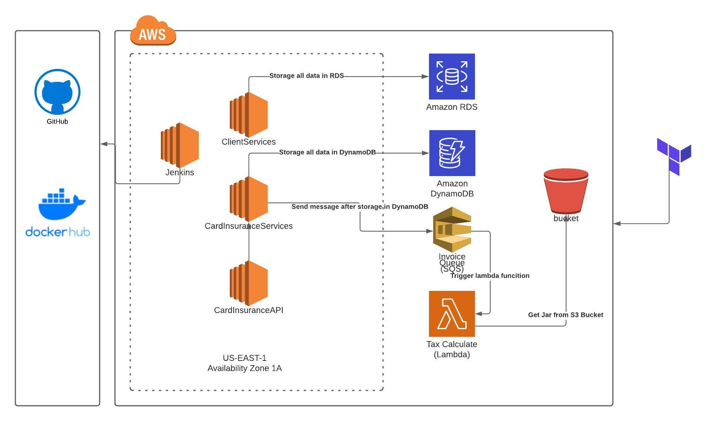

## Introdução
O Objetivo deste projeto é mostrar como é possível realizar a integração de serviços SOAP com serviços REST na AWS e também com o uso de lambdas, usando a stack abaixo.

## Modelo de negócio
O domínio utilizado para esta aplicação é um cadastro de clientes, cartões e seguro para cartões. O cadastro de clientes e cartões irão ficar em um serviço SOAP já o cadastro de seguro será gerenciado por um outro serviço feito em REST. O cancelamento de um seguro será feito atráves de uma lambda.

## Infraestrutura
No diagrama abaixo mostra como será organizado a infraestrutura.

## Tecnologias utilizadas
* SOAP
* REST
* GIT
* GitHub
* Java 11
* PostGreSQL
* Spring Boot
* Spring JPA
* Dynamo DB
* Docker
* Terraform
* Jenkins
* AWS EC2 (Ubuntu)
* AWS S3
* AWS RDS
* AWS DynamoDB
* AWS SQS
* AWS Lambda
* Clean Architecture
* Domain Driven Design