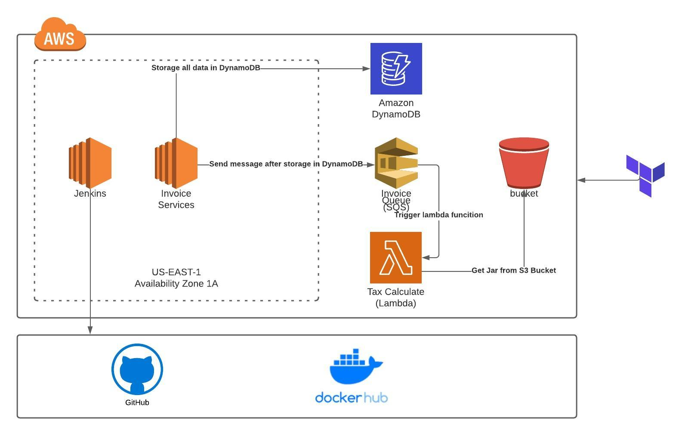

# Introduction 
This is a simple project to show how use Spring Boot + GitHub + Jenkins + AWS EC2 + AWS DynamoDB + AWS SQS + AWS Lambda + Terraform

# Infra

#### Getting Started 
For running this project it's necessary install some items:
* Gradle
* Docker
* Java 11
* Git

#### Technologies
* Java 11
* Spring Boot
* Spring JPA
* Dynamo DB
* Docker
* Terraform
* AWS EC2
* AWS DynamoDB
* AWS SQS
* AWS Lambda
